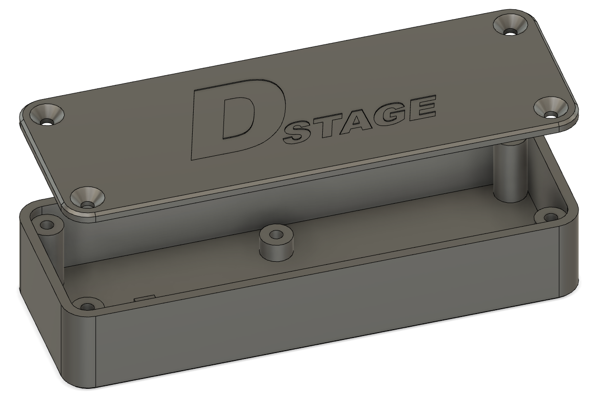

# 3D model for ETC v1.x case

Here you can find the basic project of 3d printable case for ETC v1.x PCB in Fusion 360 format.

There are also a ready to use stl models. Please note that the basic models do not contain holes for wires so user has to chose location for those and drill them manually. 
Models including wholes and mounting tabs may be added in future.

