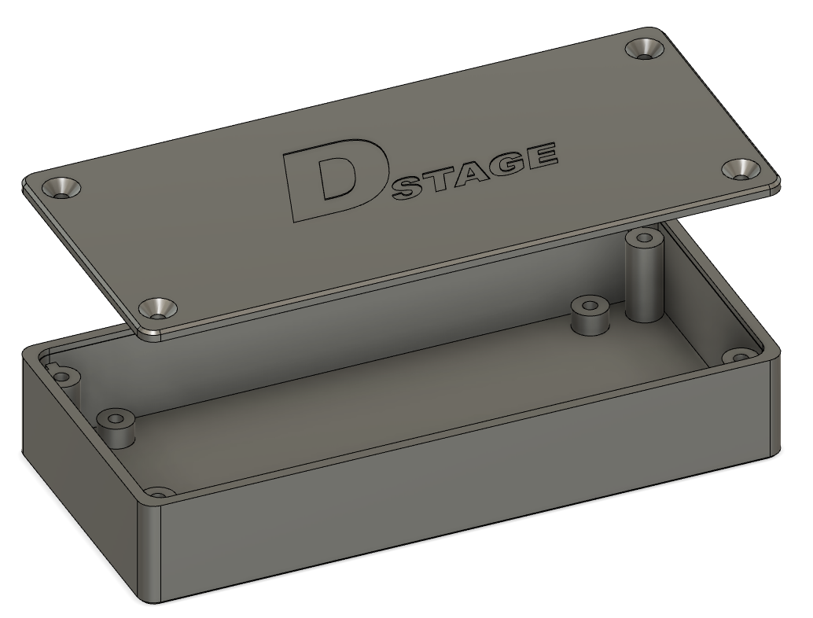
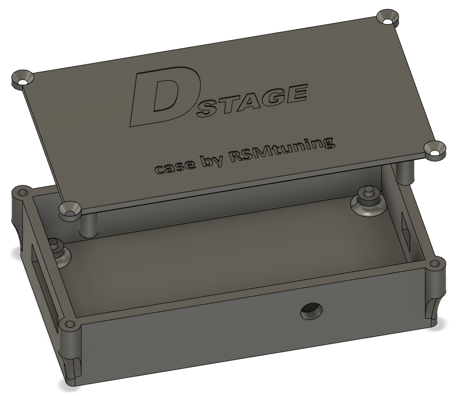

# 3D model for ETC v2.x case

## DStage ETC basic case
Here you can find the basic project of 3d printable case for ETC v2.x PCB in Fusion 360 format.

There are also a ready to use stl models. Please note that the basic models do not contain holes for wires so user has to chose location for those and drill them manually. 
Models including wholes and mounting tabs will be added in future.

## Alternative case by RSMtuning
Another approach to the case designed by one of the users - RSMtuning. This one does not use short bolts for PCB holding but a build in plastic spacer.

